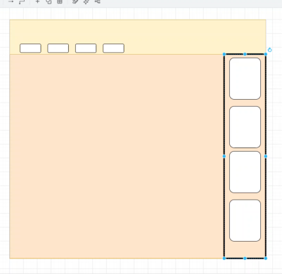
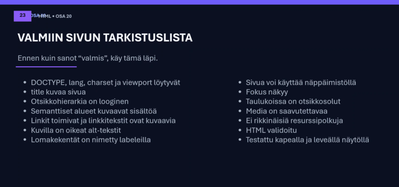

# 10.9.2026 | HTML-kertaus

- Osa 20 (Kertaus)

## Muistiinpanot:

1. html, head (meta tiedot), body, main (header, footer, nav, section, ul, li, a)

2. **Figma** (tulostaa html ja css koodi), **draw.io** ja **Canvas** (piirrretään ja suunnitellaan html sivun rakenne ja CSS tyylittely)

 
  Kohta 3 | Havaintokuva - piirrretään ja suunnitellaan html sivun rakenne ja CSS tyylittely.

3. **coolors.co/** (värigeneraattori)

4. Domainista kannattaa omistaa .fi, .org, .com, .edu yms, jotta samankaltaisilla domaineilla, mutta eri päätteillä, ei julkaista liittymättömiä sivuja.

5. Linkit: **a href=""**
- Suhteellinen linkki: tiedosto käyttää sivuston sisäisiä polkuja (../kansio1/kansio2/kuva.png).
- Absoluuttinen linkki: url-osoitteellinen, sivuston ulkopuolinen (https://www.keuda.fi).

6. IP-osoite (terminaalissa: ping) on sivujen varsinainen nimi.

7. **DevTools (F12)** toimii hyödyllisenä tarkastajana nettisivulle.

8. MERKITYKSEN MUKAAN: header, nav, main, section, article, aside, footer. Div, jos sille ei löydy muuta semanttista rakennetta.

9. **ul**, kun listan järjestyksellä ei ole väliä. **ol**, jos listan järjestyksellä on väliä.

10. **Taulukot täytyy opetella.**

11. **Lomakkeet täytyy opetella.**

12. **Multimedia pitää opetella**

13. **Saavutettavuus täytyy opetella**

14. **HTML API ja toiminnallisuus täytyy opetella**

15. Canvas = pikselipohjaista grafiikkaa

16. SVG = vektoripohjaista grafiikkaa

- rx="" ja ry="" pyöristävät "rect" kulmat.

17. HTML validaattori

18. Selain: lukee HTML, luo DOM = Document Object Model, yhdistää resurssit (CSS, kuvat, script) & renderöi sivun (näkyvä käyttöliittymä)

19. Debugging: Lue virhe, rajaa (mikä tiedosto/elementti liittyy ongelmaan), tarkista rakenne (onko tagit, polut ja atribuutit kunnossa), DevTools (Elements, console, network, accessibility), validoi, muuta yksi asia kerrallaan.

20. Tarkista valmis sivu.

  Kohta 20 | HTML sivun tarkastuslista.

**HTML kuvaa sisältöä, CSS vastaa ulkoasusta ja JavaScript on toiminnallisuus/käyttäytyminen!**

**Tee HTML rakenne niin, että siitä voisi joku toinen jatkaa. Jos ei voi; yksinkertaista.**